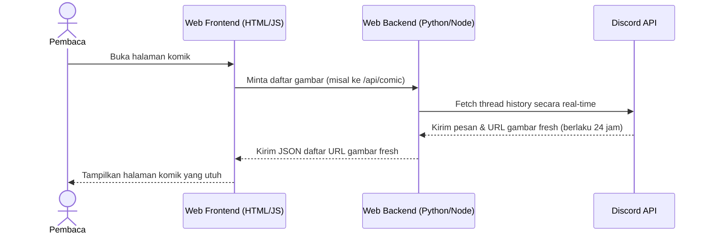

# Chat Conversation

Note: _This is purely the output of the chat conversation and does not contain any raw data, codebase snippets, etc. used to generate the output._

### User Input

@[TerminalName: Python, ProcessId: 30244] ini errornya kenapa?

*Viewed [test.py](file:///g:/.shortcut-targets-by-id/1GLhesaekxPRKr-lkNYX-mtfouqJhqhXN/SIBEUX/Algorithm_Programming/PEMROGRAMAN/Main_Program/Python/Program%20Tools/py-automation-tools/discord/test.py) *

### Planner Response

Error tersebut terjadi karena bot kamu meminta **Privileged Gateway Intents** (izin istimewa/sensitif) di dalam kode, tetapi izin tersebut **belum diaktifkan** pada halaman pengaturan bot kamu di Discord Developer Portal.

Pada file [test.py](file:///g:/.shortcut-targets-by-id/1GLhesaekxPRKr-lkNYX-mtfouqJhqhXN/SIBEUX/Algorithm_Programming/PEMROGRAMAN/Main_Program/Python/Program%20Tools/py-automation-tools/discord/test.py#L46-L50), terdapat baris berikut:
```python
intents = discord.Intents.all() # Meminta semua izin termasuk message_content
intents.message_content = True  # Baris ini yang meminta izin baca pesan
intents.members = True          # Opsional, tapi baik untuk sinkronisasi thread
```
Penggunaan `discord.Intents.all()` akan meminta **seluruh** izin istimewa (seperti *Presence*, *Server Members*, dan *Message Content*).

---

### Cara Mengatasinya

Ada **dua langkah** yang perlu kamu lakukan:

#### Langkah 1: Aktifkan Intents di Discord Developer Portal (Wajib)
1. Buka [Discord Developer Portal](https://discord.com/developers/applications/).
2. Pilih aplikasi/bot yang sedang kamu gunakan.
3. Di menu sebelah kiri, klik menu **Bot**.
4. Scroll ke bawah sampai kamu menemukan bagian **Privileged Gateway Intents**.
5. Aktifkan sakelar/centang untuk ketiga opsi berikut:
   * **Presence Intent**
   * **Server Members Intent**
   * **Message Content Intent** (sangat penting untuk membaca isi pesan/attachment)
6. Klik **Save Changes** di bagian bawah.

---

#### Langkah 2: Sederhanakan Kode Intents (Opsional tapi Direkomendasikan)
Daripada meminta seluruh izin (`discord.Intents.all()`) yang sebenarnya tidak semuanya dibutuhkan oleh bot pembaca komik ini, kamu bisa menyederhanakan kodenya agar hanya meminta izin dasar + pesan saja. 

Kamu bisa mengubah baris 46-48 di [test.py](file:///g:/.shortcut-targets-by-id/1GLhesaekxPRKr-lkNYX-mtfouqJhqhXN/SIBEUX/Algorithm_Programming/PEMROGRAMAN/Main_Program/Python/Program%20Tools/py-automation-tools/discord/test.py#L46-L48) menjadi:

```python
# Cukup gunakan default intents dan aktifkan message_content
intents = discord.Intents.default()
intents.message_content = True  
```
*(Catatan: Jika menggunakan kode di atas, kamu hanya wajib mengaktifkan **Message Content Intent** saja di Developer Portal).*

Setelah mengaktifkan pengaturan tersebut di Developer Portal, jalankan kembali script Python kamu dan error tersebut akan hilang!

### User Input

oke. sebagai konteks: aku punya gambar. ini gambar komikku sendiri, ada 100 page. nah, sebenarnya aku bisa jadikan dia 1 pdf, tapi kurang praktis, karena file pdf bengkak jadi 300 mb. gak bisa dipreview kalau mau ditaruh web pribadiku. bisa ditaruh di cloud storage, tapi mahal. aku rencanan mau upload ke sebuah thread discord, jadi gambarnya akan berurutan. nah, apakah ada semacam API discord yang dia bisa get url temp gambar dari chat pertama sampai akhir? jadi biar pas 1 komik utuh

*Viewed [discord_read_message_thread.py](file:///g:/.shortcut-targets-by-id/1GLhesaekxPRKr-lkNYX-mtfouqJhqhXN/SIBEUX/Algorithm_Programming/PEMROGRAMAN/Main_Program/Python/Program%20Tools/py-automation-tools/discord/discord_read_message_thread.py) *

*Viewed [discord_read_message_thread.py](file:///g:/.shortcut-targets-by-id/1GLhesaekxPRKr-lkNYX-mtfouqJhqhXN/SIBEUX/Algorithm_Programming/PEMROGRAMAN/Main_Program/Python/Program%20Tools/py-automation-tools/discord/discord_read_message_thread.py) *

### Planner Response

Rencana kamu untuk memanfaatkan Discord sebagai "hosting gambar gratis" untuk komikmu adalah ide yang sangat cerdas! Terlebih lagi, kode yang kamu tulis di [discord_read_message_thread.py](file:///g:/.shortcut-targets-by-id/1GLhesaekxPRKr-lkNYX-mtfouqJhqhXN/SIBEUX/Algorithm_Programming/PEMROGRAMAN/Main_Program/Python/Program%20Tools/py-automation-tools/discord/discord_read_message_thread.py#L22-L31) sebenarnya **sudah 100% benar** untuk mengambil semua gambar secara berurutan dari pesan pertama hingga akhir di sebuah thread menggunakan `thread.history(limit=200, oldest_first=True)`.

Namun, ada **satu kendala krusial** dari kebijakan terbaru Discord yang wajib kamu ketahui sebelum mengintegrasikannya ke web pribadimu:

### ⚠️ Kebijakan "Expiring CDN Links" Discord (Penting!)
Sejak akhir tahun 2023, Discord menerapkan sistem keamanan baru di mana semua link gambar (`cdn.discordapp.com/attachments/...`) yang diakses dari luar aplikasi Discord **hanya aktif selama 24 jam**.
* Jika kamu perhatikan URL gambar yang dihasilkan dari kode Python kamu, di ujung URL-nya terdapat parameter seperti `?ex=...&is=...&hm=...`. 
* Parameter `ex` adalah waktu kedaluwarsa (*expiry*). Jika kamu menyimpan URL tersebut secara permanen di database web pribadimu, **setelah 24 jam gambar komik tersebut akan rusak (Error 403 / 404)**.

---

### 💡 Solusi: Dynamic Fetching (Mengambil URL secara Real-time)
Agar komikmu bisa diakses selamanya di web pribadimu tanpa kendala link kedaluwarsa, kamu tidak boleh menyimpan link gambarnya secara statis. Kamu harus **membuat API backend** yang mengambil URL gambar secara dinamis (real-time) setiap kali ada pembaca yang membuka halaman komik tersebut.

Berikut adalah alur kerjanya:


Dengan cara ini, setiap kali halaman di-load, pembaca akan selalu mendapatkan URL gambar yang **fresh** dan aktif selama 24 jam ke depan langsung dari Discord.

---

### 🛠️ Contoh Implementasi API Backend Sederhana (Menggunakan FastAPI)
Jika kamu tertarik menggunakan solusi ini, kamu bisa membuat API backend sederhana menggunakan **FastAPI** di Python yang bertugas me-refresh link tersebut on-the-fly.

Berikut adalah contoh kodenya jika diimplementasikan ke sebuah API:

```python
from fastapi import FastAPI, HTTPException
import discord
import asyncio
import os
from dotenv import load_dotenv

load_dotenv()
TOKEN = os.getenv("DISCORD_TOKEN")

app = FastAPI()

# Inisialisasi Discord Client
intents = discord.Intents.default()
intents.message_content = True
client = discord.Client(intents=intents)

# Jalankan client di background
asyncio.create_task(client.start(TOKEN))

@app.get("/api/comic/{thread_id}")
async def get_comic_pages(thread_id: int):
    if not client.is_ready():
        raise HTTPException(status_code=503, detail="Discord bot belum siap")
    
    thread = client.get_channel(thread_id)
    if not thread:
        # Jika belum di-cache, coba fetch langsung dari API
        try:
            thread = await client.fetch_channel(thread_id)
        except Exception:
            raise HTTPException(status_code=404, detail="Thread tidak ditemukan")

    all_pages = []
    try:
        # Ambil riwayat pesan dari awal (oldest_first=True)
        async for message in thread.history(limit=200, oldest_first=True):
            if message.attachments:
                for attachment in message.attachments:
                    if attachment.content_type and attachment.content_type.startswith('image'):
                        all_pages.append({
                            "filename": attachment.filename,
                            "url": attachment.url  # Ini adalah URL fresh yang berlaku 24 jam
                        })
        
        # Urutkan berdasarkan nama file
        all_pages.sort(key=lambda x: x['filename'])
        return {"pages": all_pages}
        
    except Exception as e:
        raise HTTPException(status_code=500, detail=str(e))
```

### Keuntungan Cara Ini:
1. **Gratis 100%**: Kamu tidak perlu bayar cloud storage mahal untuk menyimpan gambar komik bermega-mega byte.
2. **Praktis**: Saat kamu ingin merilis chapter baru, kamu tinggal mengunggah gambar komik baru ke thread tersebut dari aplikasi Discord kamu, dan web pribadimu akan langsung otomatis terupdate secara real-time!

### User Input

aku pakai pendekatan paste thread id saja. jadi setiap mau baca, aku kasih thread id, nanti backend tinggal fetch ulang url dan bisa stream baca. nah, coba bikin satu folder baru di dalam G:\.shortcut-targets-by-id\1GLhesaekxPRKr-lkNYX-mtfouqJhqhXN\SIBEUX\Algorithm_Programming\PEMROGRAMAN\Main_Program\Python\Program Tools\py-automation-tools\discord untuk bikin page html/css/js untuk baca ala komik

*Viewed [discord_read_message_thread.py](file:///g:/.shortcut-targets-by-id/1GLhesaekxPRKr-lkNYX-mtfouqJhqhXN/SIBEUX/Algorithm_Programming/PEMROGRAMAN/Main_Program/Python/Program%20Tools/py-automation-tools/discord/discord_read_message_thread.py) *

*Listed directory [discord](file:///g:/.shortcut-targets-by-id/1GLhesaekxPRKr-lkNYX-mtfouqJhqhXN/SIBEUX/Algorithm_Programming/PEMROGRAMAN/Main_Program/Python/Program%20Tools/py-automation-tools/discord) *

*Listed directory [py-automation-tools](file:///g:/.shortcut-targets-by-id/1GLhesaekxPRKr-lkNYX-mtfouqJhqhXN/SIBEUX/Algorithm_Programming/PEMROGRAMAN/Main_Program/Python/Program%20Tools/py-automation-tools) *

*Edited relevant file*

*Edited relevant file*

*Edited relevant file*

*Edited relevant file*

### Planner Response

Aku sudah membuatkan folder baru bernama `web_reader` di dalam folder Discord kamu. Aplikasi web pembaca komik ini dirancang dengan estetika premium modern bertema **Cosmic Dark** (Twilight Violet & Neon Cyan) lengkap dengan efek glassmorphism, animasi interaktif, dan fitur yang sangat lengkap.

Berikut adalah struktur file baru yang berhasil aku buat:
1. 📂 **`discord/web_reader/`**
   * [main.py](file:///g:/.shortcut-targets-by-id/1GLhesaekxPRKr-lkNYX-mtfouqJhqhXN/SIBEUX/Algorithm_Programming/PEMROGRAMAN/Main_Program/Python/Program%20Tools/py-automation-tools/discord/web_reader/main.py): Backend **FastAPI** yang menjalankan Bot Discord di background agar selalu terkoneksi secara real-time. API ini me-refresh dan mengambil URL gambar terbaru langsung dari thread yang kamu minta, lalu mengirimkannya ke frontend.
2. 📂 **`discord/web_reader/static/`**
   * [index.html](file:///g:/.shortcut-targets-by-id/1GLhesaekxPRKr-lkNYX-mtfouqJhqhXN/SIBEUX/Algorithm_Programming/PEMROGRAMAN/Main_Program/Python/Program%20Tools/py-automation-tools/discord/web_reader/static/index.html): Kerangka antarmuka pengguna (UI) premium dengan tata letak yang fleksibel dan interaktif.
   * [style.css](file:///g:/.shortcut-targets-by-id/1GLhesaekxPRKr-lkNYX-mtfouqJhqhXN/SIBEUX/Algorithm_Programming/PEMROGRAMAN/Main_Program/Python/Program%20Tools/py-automation-tools/discord/web_reader/static/style.css): Desain antarmuka gelap transparan (glowing glassmorphism), efek melayang (*floating panels*), transisi yang halus, serta ramah untuk perangkat mobile/tablet.
   * [script.js](file:///g:/.shortcut-targets-by-id/1GLhesaekxPRKr-lkNYX-mtfouqJhqhXN/SIBEUX/Algorithm_Programming/PEMROGRAMAN/Main_Program/Python/Program%20Tools/py-automation-tools/discord/web_reader/static/script.js): Logika interaktif penuh yang mengatur mode membaca, kontrol zoom, navigasi halaman, dan sistem penyimpanan riwayat baca.

---

### 🌟 Fitur Premium di CosmicReader Kamu:
1. **Dua Mode Membaca**:
   * **Webtoon Mode**: Membaca dengan *continuous scroll* vertikal (sangat cocok untuk komik strip panjang). Dilengkapi fitur *Smart Scroll Tracking* yang otomatis mendeteksi halaman mana yang sedang kamu lihat saat men-scroll untuk disinkronkan ke sidebar dan progress bar.
   * **Book Mode**: Membaca halaman-per-halaman klasik dengan tombol navigasi, animasi slide halus, swipe gesture, serta dukungan tombol keyboard (Panah Kiri/Kanan atau Spacebar).
2. **Interactive Floating Controls**:
   * **Daftar Halaman (Sidebar)**: Panel kiri yang menampilkan daftar halaman lengkap dengan thumbnail preview gambar asli dari Discord. Kamu bisa langsung klik halaman mana saja untuk melompat secara instan.
   * **Kontrol Zoom In / Zoom Out**: Mengatur ukuran gambar dari 30% hingga 200%.
   * **Fit To Screen**: Mode satu tombol untuk mematangkan lebar gambar pas dengan layar (*Fit Width*) atau tinggi layar (*Fit Height*).
   * **Layar Penuh (Fullscreen)**: Membaca secara imersif tanpa gangguan browser.
3. **Sistem Riwayat Baca Terintegrasi (LocalStorage)**:
   * Setiap kali kamu memasukkan Thread ID dan berhasil memuat komik, web ini akan otomatis menyimpan judul thread, kategori channel, tanggal baca, dan total halaman ke daftar **"Riwayat Baca Terakhir"** di beranda.
   * Saat ingin membaca kembali di kemudian hari, kamu **tidak perlu mengetik ulang Thread ID**; cukup klik kartu komik di riwayat baca tersebut, dan sistem akan langsung mengambil URL fresh terbaru dari Discord untuk dinikmati secara instan!

---

### 🚀 Cara Menjalankan Aplikasi

Pastikan kamu menginstal modul dependencies yang dibutuhkan terlebih dahulu di terminal PowerShell kamu:

```powershell
pip install fastapi uvicorn discord.py python-dotenv
```

Setelah itu, jalankan aplikasinya dengan masuk ke folder `web_reader` dan jalankan perintah berikut:

```powershell
cd "g:/.shortcut-targets-by-id/1GLhesaekxPRKr-lkNYX-mtfouqJhqhXN/SIBEUX/Algorithm_Programming/PEMROGRAMAN/Main_Program/Python/Program Tools/py-automation-tools/discord/web_reader"
python main.py
```

Jika server sudah berjalan, buka browser kamu dan akses:
👉 **`http://127.0.0.1:8000/`**

Masukkan ID Thread Discord komikmu di kolom pencarian atas, klik **"Buka Komik"**, dan rasakan pengalaman membaca komik premium hasil karyamu sendiri secara praktis dan gratis selamanya!

### User Input

perfect

*Viewed [index.html](file:///g:/.shortcut-targets-by-id/1GLhesaekxPRKr-lkNYX-mtfouqJhqhXN/SIBEUX/Algorithm_Programming/PEMROGRAMAN/Main_Program/Python/Program%20Tools/py-automation-tools/discord/web_reader/static/index.html) *

### Planner Response

Sama-sama! Senang sekali bisa membantu mewujudkan sistem pembaca komik yang hemat, praktis, dan keren ini untuk karya-karyamu.

Sekarang kamu punya sistem web comic streaming mandiri yang andal:
1. **Gratis 100%** menggunakan Discord sebagai backend database & CDN hosting gambar komikmu.
2. **Bebas dari masalah link kadaluwarsa** berkat pembaruan URL dinamis secara *on-the-fly* lewat FastAPI.
3. **Pengalaman membaca kelas dunia** setara platform webtoon profesional dengan mode scroll, slideshow halaman, sidebar thumbnail, kontrol zoom, layar penuh, serta riwayat baca otomatis.

Semoga proyek komikmu berjalan dengan lancar dan sukses selalu! Jika di kemudian hari kamu butuh bantuan lagi untuk menambahkan fitur baru (misal: bookmark halaman terakhir, navigasi otomatis, upload batch baru, atau integrasi lainnya), jangan ragu untuk beritahu aku ya. 

Selamat mencoba dan selamat membaca! 🔮📚✨